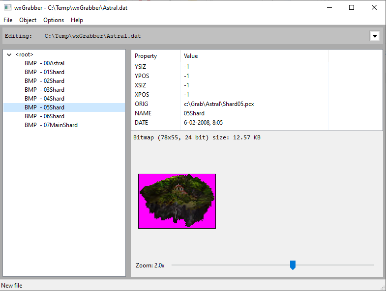
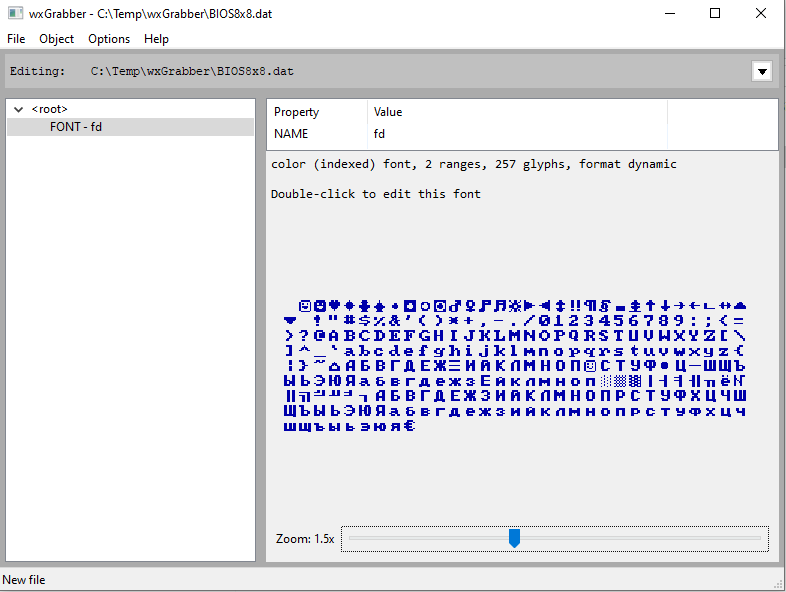
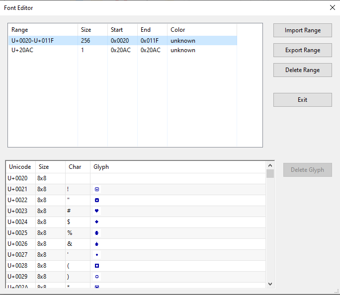

# wxGrabber

**Allegro Datafile Editor (wxGrabber)**

wxGrabber is a modern, cross-platform graphical editor for Allegro datafiles, built with wxWidgets. It remakes all functions from the original Grabber utility from the Allegro 4 library, but also adds extra features and improvements. It allows you to view, edit, create, and manage Allegro `.dat` resource files, including bitmaps, audio, fonts, palettes, animations, and more.

## Features

- **Open, edit, and save Allegro `.dat` files** (including support for compression, password protection, and backup)
- **Tree-based object browser** for easy navigation and organization of resources
- **Import/export support** for a wide range of formats:
  - Bitmaps: BMP, PNG, JPEG, TGA, PCX
  - Audio: WAV, OGG, MIDI
  - Video: FLI/FLC animations
  - Fonts: BMP, PCX, TGA, FNT
  - Palettes
  - Raw binary data
- **Create new resources**: Bitmap, RLE sprite, Compiled sprite, X-compiled sprite, Datafile, FLI/FLC animation, Font, MIDI, Palette, Sample, Ogg audio, and custom types
- **Edit object properties** and metadata
- **Preview images, audio, video, and fonts** directly in the app
- **Drag-and-drop** reordering and nesting of objects
- **Batch operations**: Change color depth, type, filename mode, autocrop, and more
- **Shell integration**: Edit objects with external tools
- **Customizable settings**: Dithering, transparency, relative/absolute paths, etc.
- **Header file generation** for C/C++ projects
- **Unit tests** for compression/decompression routines

## Screenshots


*Main application window*


*Resource tree and preview panel*


*Editing a resource property*

## Building

### Prerequisites

- **wxWidgets 3.x** (development libraries)
- **CMake** (for build configuration)
- **A C++17 compiler** (GCC, Clang, MSVC, etc.)

### Build Steps

```sh
git clone https://github.com/yourusername/wxGrabber.git
cd wxGrabber
mkdir build
cd build
cmake ..
cmake --build .
```

- On Windows, you may use CMake Presets or open the generated project in Visual Studio.
- On Linux/macOS, ensure `wx-config` is in your PATH.

### Running

After building, run the executable:

```sh
./wxGrabber
```
or on Windows:
```sh
wxGrabber.exe
```

## Command Line Arguments

- `-debug` : Enables debug-level logging output to `log.txt` and the console.
- `-test`  : Runs built-in unit tests (such as LZSS compression/decompression tests) and exits. The main application window will not open.

You can combine these arguments as needed:

```sh
./wxGrabber -debug
./wxGrabber -test
```

## Usage

- **Open a `.dat` file**: File → Load
- **Edit resources**: Use the tree to select and right-click for context menu actions, or use the Object menu. For some object types (e.g., fonts), you can also double-click the item in the tree to open a specialized editor.
- **Add new resources**: Object → New, or right-click in the tree and choose New.
- **Export resources**: Select an object and choose Export.
- **Save changes**: File → Save or Save As.
- **Generate C header**: Enter a header name in the UI and save the datafile.

## Supported Object Types

- Bitmap, RLE Sprite, Compiled Sprite, X-Compiled Sprite
- Datafile (nested)
- FLI/FLC Animation
- Font
- MIDI File
- Palette
- Sample (WAV)
- Ogg Audio
- Raw Binary Data
- Custom types

## Configuration

- **allegro.cfg**: Stores user preferences and shell command associations.
- **log.txt**: Log file for debugging and status output.

## License

MIT License (c) 2025 Synoecium

## Credits

- Built with [wxWidgets](https://www.wxwidgets.org/)
- Uses [Allegro](https://liballeg.org/) datafile concepts 